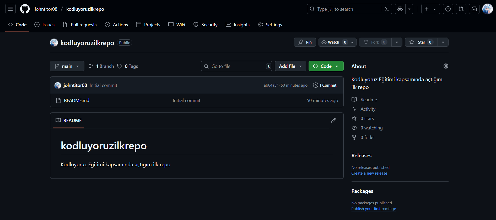

# Kodluyoruz İlk Repo

Bu repo [Kodluyoruz](https://www.kodluyoruz.org/) Front-End Eğitiminde oluşturduğumuz ilk repo. İçerisinde bir adet README dosyası ve bir adet index.html dosyası barındırıyor.



## Installation

Projeyi klonlamak için:

```bash
git clone https://github.com/johntitor08/kodluyoruzilkrepo.git
```

## Usage

Projeyi klonladıktan sonra Visual Studio Code programında açınız.

Linux için:

```bash
cd kodluyoruzilkrepo
code .
```

## Contributing

Pull requestler kabul edilir. Büyük değişiklikler için, lütfen önce neyi değiştirmek istediğinizi tartışmak için bir konu açınız.

## License

[MIT](/license)
